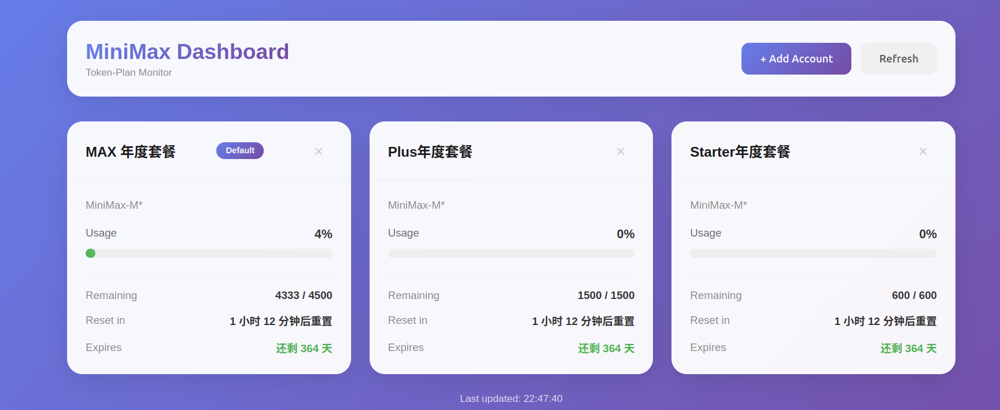

# MiniMax Token-Plan 仪表盘

用于监控 MiniMax Token-Plan 使用情况的多账号 Web 仪表盘。

 

## 功能特性

- **多账号支持** - 同时监控多个 MiniMax 账号
- **实时监控** - 自动刷新使用数据（可配置间隔）
- **用量追踪** - 显示剩余次数、重置倒计时、周限额
- **订阅状态** - 追踪套餐到期时间
- **颜色状态指示** - 可视化的用量等级提示
- **简洁 Web 界面** - 现代、响应式仪表盘界面
- **刷新间隔** - 可配置自动刷新（手动、10秒、30秒、1分钟、5分钟、10分钟）
- **多语言支持** - 简体中文、繁体中文、English
- **主题切换** - 渐变、浅色、深色、跟随系统

## 截图



## 环境要求

- Node.js v18 或更高版本
- MiniMax API Token

## 快速开始

```bash
# 克隆或下载项目
cd minimax-status-ui

# 安装依赖
npm install

# 启动仪表盘
npm start
```

在浏览器中打开 **http://localhost:7777**

## 配置说明

### 获取 API Token

1. 访问 [MiniMax 开放平台](https://platform.minimaxi.com/user-center/payment/coding-plan)
2. 登录并进入 Coding Plan
3. 创建或复制您的 API Key

### 添加账号

1. 点击仪表盘上的 **"+ 添加账号"**
2. 输入账号名称和 API Token
3. Group ID 为可选参数（高级用户）

## 项目结构

```
minimax-status-ui/
├── src/
│   ├── index.js              # Express 服务器入口
│   ├── api/
│   │   └── minimax.js       # MiniMax API 客户端
│   ├── config/
│   │   └── config-manager.js # 账号配置管理器
│   ├── routes/
│   │   └── accounts.js       # 账号 API 路由
│   └── public/
│       ├── index.html        # 仪表盘 HTML
│       ├── styles.css        # 仪表盘样式
│       └── dashboard.js      # 前端 JavaScript
├── .gitignore
├── package.json
├── README.md
└── README_zh-CN.md
```

## API 端点

| 方法 | 端点 | 说明 |
|------|------|------|
| GET | `/api/health` | 健康检查 |
| GET | `/api/accounts` | 列出所有账号 |
| POST | `/api/accounts` | 添加新账号 |
| DELETE | `/api/accounts/:id` | 删除账号 |
| GET | `/api/status/:accountId` | 获取账号使用状态 |
| GET | `/api/settings` | 获取设置（refreshInterval, theme, language） |
| PUT | `/api/settings` | 更新设置 |

## 配置文件

账号数据存储在 `~/.minimax-accounts.json`，结构如下：

```json
{
  "accounts": [
    {
      "id": "acc_1234567890",
      "name": "我的账号",
      "token": "your_api_token",
      "groupId": null,
      "isDefault": true
    }
  ],
  "settings": {
    "refreshInterval": 30,
    "theme": "gradient",
    "language": "zh-CN"
  }
}
```

### 设置选项

| 设置 | 选项 | 默认值 |
|------|------|--------|
| refreshInterval | 0 (手动), 10, 30, 60, 300, 600 | 30 |
| theme | gradient, light, dark, system | gradient |
| language | zh-CN, zh-TW, en | zh-CN |

## 用量显示

### 用量颜色

| 用量 | 颜色 | 状态 |
|------|------|------|
| < 60% | 绿色 | 正常 |
| 60-85% | 黄色 | 警告 |
| > 85% | 红色 | 紧急 |

### 到期颜色

| 剩余天数 | 颜色 |
|----------|------|
| > 7 天 | 绿色 |
| 3-7 天 | 黄色 |
| < 3 天 | 红色 |

## 命令行

```bash
# 启动仪表盘
npm start

# 或直接运行
node src/index.js
```

## 许可证

MIT 许可证 - 详见 [LICENSE](LICENSE) 文件。

## 作者

[foreverXyoung](https://github.com/foreverXyoung)

## 致谢

基于 Jochen Yang 的 [minimax-status](https://github.com/JochenYang/minimax-status)。
